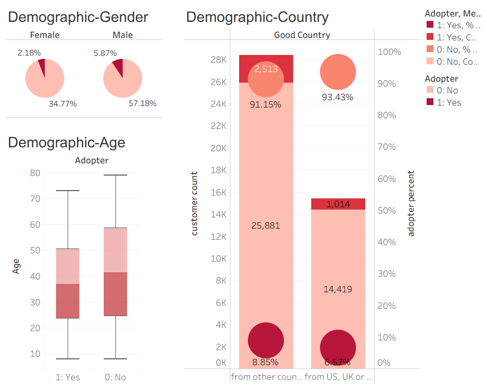
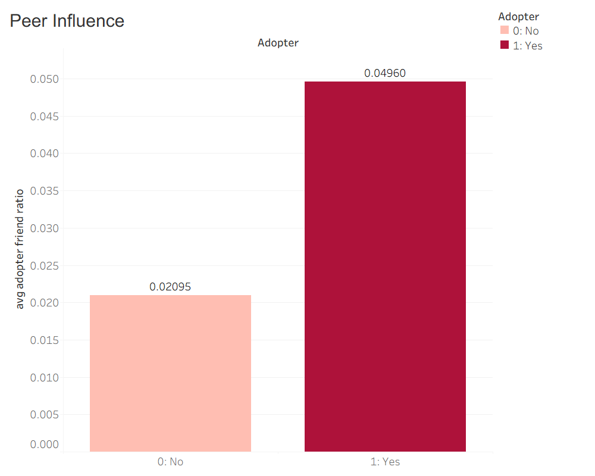
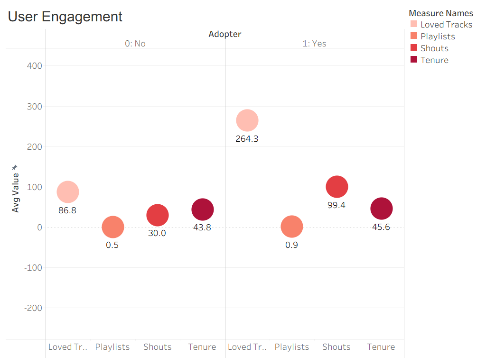
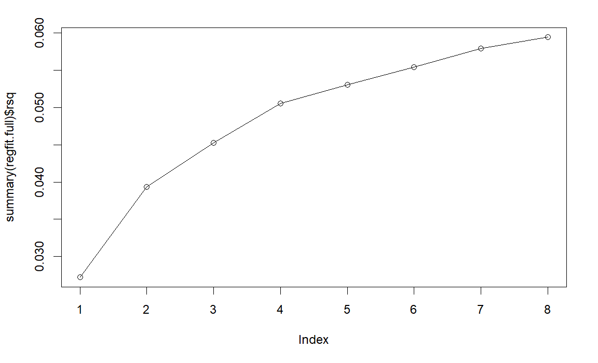

## Problem

High Note, a music streaming platform operating on a freemium model, had 1.2M+ users but only ~3% premium subscriber rate. Ad revenue alone couldn't cover operating costs, making premium conversion the company's central business challenge.

Our team analyzed user-level data to answer three questions:

1. What behavioral and social factors predict premium adoption?
2. Does having premium-subscriber friends *causally* increase a user's conversion probability?
3. Which variables are most predictive — and how few do you need for accurate targeting?

## Data

- **Dataset:** 43,827 High Note users (instructor case, University of Minnesota SOBACO lab)
- **Variables:** Demographics (age, gender, country), social network (friend count, subscriber friend count, friend diversity), engagement (songs listened, loved tracks, playlists, shouts, posts), tenure
- **Target:** `adopter` — binary flag, 1 = upgraded to premium subscription

## Approach

### Stage 1 — Descriptive Statistics & Adopter vs. Non-Adopter Comparison

Computed means, standard deviations, and ranges for all key variables. Compared adopters (premium) against non-adopters (freemium) across three dimensions:

**Demographics:** Adopters tend to be slightly younger (avg 26 vs 24), slightly more male (76% vs 66%), and slightly more likely to be from outside the US/UK/Germany. Differences are modest — demographics alone are weak predictors.

**Peer Influence:** Adopters have an adopter-friend ratio of **0.0496** vs **0.02095** for non-adopters — more than twice the proportion of premium friends. Strong association, but correlation, not causation.

**User Engagement:** Adopters average **264.3 loved tracks** vs 86.8 for non-adopters; **99.4 shouts** vs 30. Songs listened: 33,758 vs 17,589. Playlist creation and tenure show smaller differences.

### Stage 2 — Propensity Score Matching (PSM)

**Why PSM?** Directly comparing users with vs without premium friends conflates the peer effect with underlying activity levels — highly active users both have more friends AND are more likely to pay. PSM controls for confounders to isolate the causal effect.

**Method:**
- Treatment group: users with ≥1 paying friend (9,823 users)
- Control group: users with no paying friends
- Covariates: 13 features including age, gender, friend count, songs listened, posts, playlists, tenure
- Matching: 1:1 nearest-neighbor on logistic propensity scores

**Results:**

| Metric | Value |
|---|---|
| Treatment group conversion rate | 17.75% |
| Control group conversion rate | 9.76% |
| Average Treatment Effect (ATE) | **+7.99 pp** |
| T-statistic | 16.37 |
| P-value | 8 × 10⁻⁶⁰ |

**Interpretation:** Having at least one paying friend increases a free user's conversion probability by ~8 percentage points — nearly doubling the baseline rate. The result is highly significant, providing causal evidence that peer influence drives monetization.

### Stage 3 — Logistic Regression

Binomial logistic regression to predict adoption and estimate log-odds ratios for each predictor.

**Significant at α = 0.00 (11 variables):**
- Loved tracks, songs listened, playlists, posts
- Friend count, subscriber friend count, friend country count, average friend age
- Age, tenure, country (good country flag)

**Not significant:** whether friends are male, shouts

**Key insight:** Music interaction behaviors (liking tracks, making playlists) and social network diversity (friends from different countries) are the strongest signals. Users who actively engage with platform features AND have geographically diverse networks are most likely to convert.

### Stage 4 — Forward Subset Regression

Identified the minimum feature set that captures most predictive power. The accuracy curve plateaus meaningfully at **7 features** — these are the minimum needed for consistent targeting accuracy.

**Top 7 predictors (in order):**
1. Loved tracks
2. Songs listened
3. Subscriber friend count
4. Age
5. Good country
6. Friend country count
7. Friend count

## Key Findings

**Engagement beats demographics.** Loved tracks and songs listened are the top two predictors. How users interact with content matters far more than who they are.

**Peer influence is causal, not just correlated.** PSM confirms an 8 pp lift from having premium friends after controlling for all activity confounders. This is actionable: seeding premium users into social clusters of free users can drive conversions.

**Social network diversity is a hidden signal.** Users with friends from more countries are significantly more likely to convert — possibly reflecting early-adopter personality traits or exposure to broader platform culture.

**You need only 7 variables.** A lean targeting model using just 7 features captures most of the predictive signal — useful for real-time campaign scoring where full data isn't always available.

## Business Recommendations

**Referral program:** Incentivize existing premium subscribers to refer free-user friends (e.g., one free premium month for both parties on successful conversion). PSM proves their influence is real — turn them into the platform's conversion engine.

**Targeted promotions:** Free users who already have premium friends in their social circle have an 8 pp higher baseline conversion potential. Prioritize them for discount campaigns — highest ROI per marketing dollar.

**Encourage engagement before conversion asks:** Users who loved tracks, created playlists, and shout back-and-forth are far more likely to pay. Nudge new users toward these behaviors before showing upgrade prompts.

## Limitations

- Observational data — PSM addresses confounding but cannot rule out all unmeasured variables
- Single time-period snapshot — no longitudinal tracking of conversion timing
- Dataset is anonymized teaching case; real deployment would require A/B testing to validate PSM causal estimates
