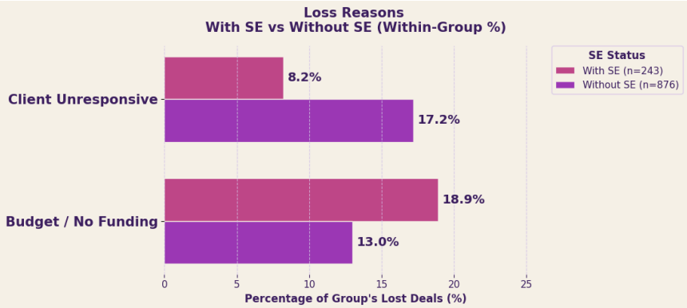
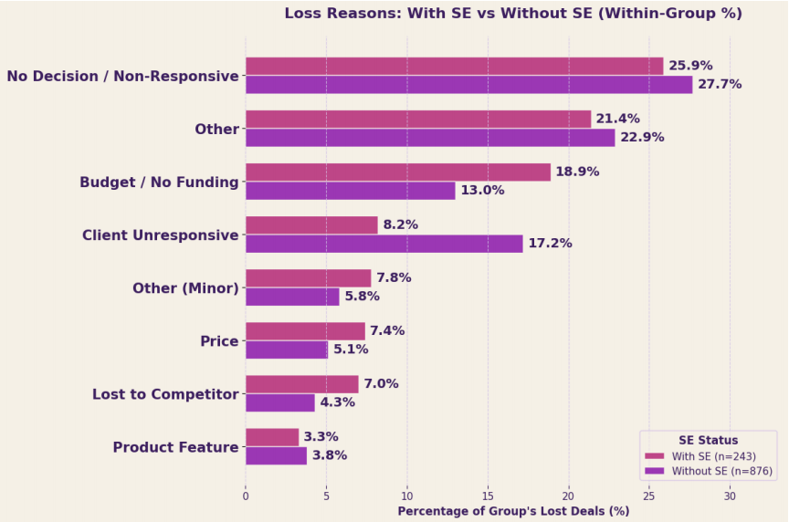
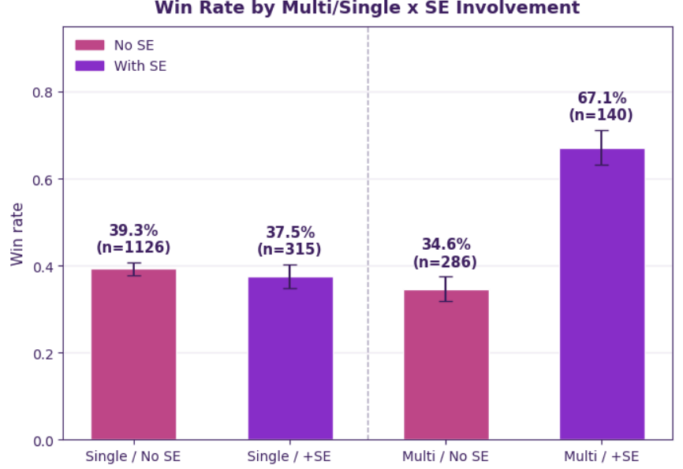
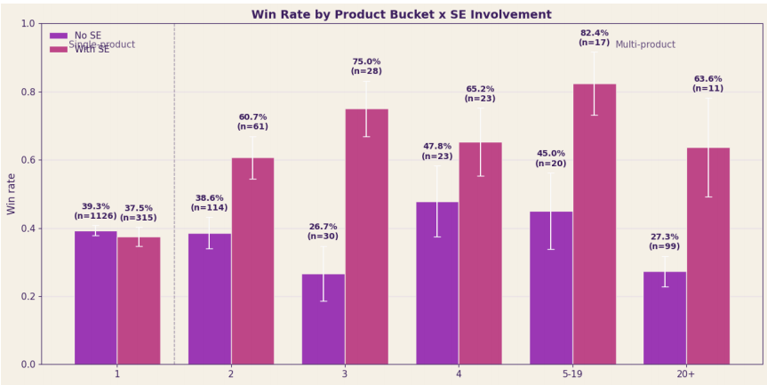
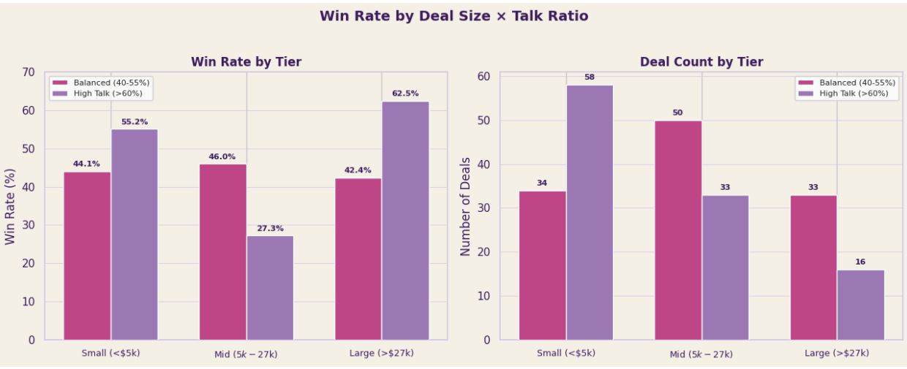
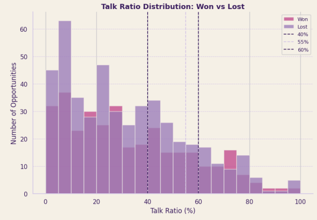
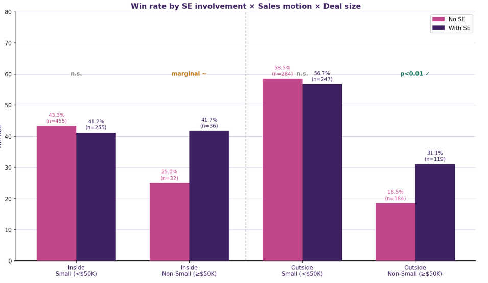
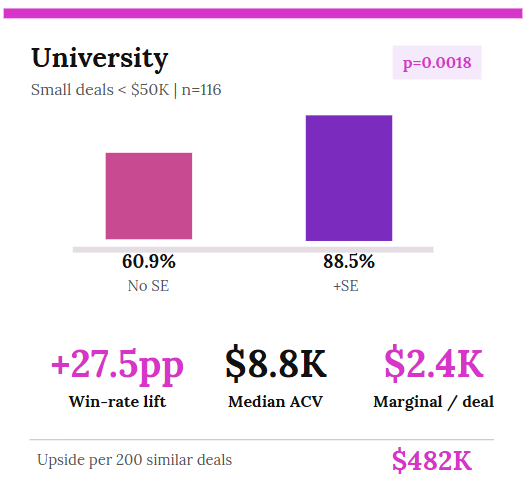
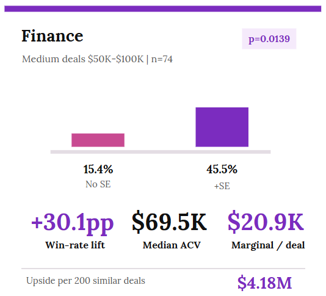

## Overview

The Sales Engineering (SE) team at one of the nation's largest PropTech companies closes deals worth **4× more** than deals without SE coverage — yet leadership had no data to prove it. SE contribution was invisible in the CRM: no way to tie SE activity to win rates, deal velocity, or revenue outcomes.

**Our mission**: quantify SE's true impact, identify the behavioral drivers of deal success, and deliver a scoring tool SE leadership can use to prioritize where to focus.

| | |
|---|---|
| **Program** | UCI Paul Merage MSBA Capstone · Jan 2026 – June 2026 |
| **My Role** | Analysis Lead |

---

## Data

Two systems, joined by a single key.

| Source | Scale | What It Captures |
|---|---|---|
| **Salesforce** | 6,039 opportunities · 61 fields | Deal outcomes, ACV, SE assignment, stage progression |
| **Gong** | 43,000 calls · 13 tables | Talk ratios, call cadence, conversation engagement |
| **Matched Dataset** | 802 deals with full coverage | Every deal with both outcome AND behavioral signal |

> *Salesforce tells us **what happened**. Gong tells us **how**. OppId is the bridge.*

---

## Five Hypotheses Tested

### H1 — SE Reshapes Why Deals Are Lost

**χ² = 20.99, p = 0.0038 · Reject H₀**

SE involvement doesn't just affect win rates — it changes the composition of losses. Deals with SE are **9 percentage points less likely** to end in "Client Unresponsive," but become more prone to stalling on budget.

| Loss Reason | With SE | Without SE | Δ |
|---|---|---|---|
| Budget / No Funding | 18.9% | 13.0% | +5.9% |
| Client Unresponsive | 8.2% | 17.2% | **−9.0%** |
| Lost to Competitor | 7.0% | 4.3% | +2.7% |

**Recommendation**: Before assigning an SE to a complex deal, validate budget availability and decision-making authority. SE time is wasted on deals that will fail for financial reasons a rep could screen out earlier.

```{=html}
<div class="vis-row">
  <div style="flex: 42%"></div>
  <div style="flex: 58%"></div>
</div>
```

---

### H2 — SE Multiplies Multi-Product Deals

**Interaction OR = 3.569, p < 0.0001 · Reject H₀**

SE has no measurable effect on single-product deals (p = 0.61) — but **nearly doubles the win rate** on multi-product deals.

| Segment | No SE | With SE | Lift |
|---|---|---|---|
| Single-product | 39.3% | 37.5% | Not significant |
| Multi-product | 34.6% | **67.1%** | **+32.5 pp** |

Sweet spot: 4-product bundles carry the highest median ACV ($32K). Beyond 20 products, complexity erodes both win rate and ACV.

**Recommendation**: Route SE capacity to multi-product opportunities — that's where SE effort produces measurable ROI.

```{=html}
<div class="vis-row">
  <div style="flex: 50%"></div>
  <div style="flex: 50%"></div>
</div>
```

---

### H3 — Talk Ratio: Precision Matters More Than Direction

**z = 1.72, p = 0.043 (mid-tier) · Conditional Reject H₀**

SEs at this company speak only **29%** of call time on average — far below Gong's 40–55% optimal range. Across all deals, talk ratio shows no significant effect (p = 0.69). But segment by deal size, and a 20-point gap emerges in mid-tier deals.

| Deal Tier | Balanced (40–55%) | High Talk (>60%) | Δ |
|---|---|---|---|
| Small (<$5K) | 44.1% | 55.2% | — |
| **Mid ($5K–$27K)** | **46.0%** | **27.3%** | **+18.7 pp** |
| Large (>$27K) | 42.4% | 62.5% | — |

**Recommendation**: For mid-complexity deals, coach SEs toward a 40–55% talk ratio. That's the only tier where the behavior change produces statistically significant, measurable ROI.

```{=html}
<div class="vis-row">
  <div style="flex: 62%"></div>
  <div style="flex: 38%"></div>
</div>
```

---

### H4 — Outside Sales Win Rate Collapses Above $50K

**p = 0.0057 · Reject H₀**

Outside sales reps outperform inside sales on small deals — but their win rate **halves** once deals exceed $50K without technical SE support.

| Channel | ≤ $50K | > $50K |
|---|---|---|
| Inside Sales | 42.5% | 33.8% |
| Outside Sales | 57.6% | **23.4%** |

SE adds **+12.6 percentage points** and **+$3,019 per deal** on outside deals ≥ $50K. Currently 184 of these high-value deals had no SE coverage — representing **~$555K in untapped incremental ACV**.

**Recommendation**: In Salesforce, trigger automatic SE assignment at first touch for Outside Sales + ACV ≥ $50K.

{width=100%}

---

### H5 — Faster Conversation Cadence Consistently Predicts Winning

**Monotonic decline significant · Reject H₀**

Win rate falls steadily as the gap between conversations widens — from **63%** on deals with calls every 10 days, down to **28%** for deals with 80+ day gaps. SE involvement raises the baseline by +10 to +24 percentage points at every cadence level, but the velocity slope is **identical** whether or not SE is involved (interaction p = 0.173, n.s.).

| Avg Gap Between Calls | Win Rate |
|---|---|
| 0–10 days | 63% (n = 49) |
| 10–20 days | 56% (n = 61) |
| 20–40 days | 48% (n = 86) |
| 40–80 days | 43% (n = 65) |
| 80+ days | 28% (n = 47) |

**Recommendation**: SE cannot compensate for slow follow-up. Regardless of SE coverage, target follow-ups within 0–30 days.

---

## Bonus Finding: SE ROI Is Segment-Specific

The same ~+28 pp win-rate lift from SE coverage produces dramatically different revenue outcomes across industries.

| Segment | SE Win Lift | Median ACV | Marginal $/deal | Upside per 200 deals |
|---|---|---|---|---|
| University (<$50K) | +27.5 pp (p = 0.002) | $8.8K | $2.4K | $482K |
| Finance ($50K–$100K) | +30.1 pp (p = 0.014) | $69.5K | $20.9K | **$4.18M** |

SE coverage should not be one-size-fits-all: Finance/mid-market delivers **9× the revenue upside** per SE hour versus small/university deals.

```{=html}
<div class="vis-row">
  <div style="flex: 50%"></div>
  <div style="flex: 50%"></div>
</div>
```

---

## Deliverable: Win-Probability Scoring Tool

We translated all five hypotheses into an interactive **Sales Intelligence dashboard** — a step-by-step calculator SE leadership can use to score any deal in the pipeline in real time.

**Inputs**: Product count · SE assigned · Engagement cadence · Sales channel · Talk ratio  
**Output**: Predicted win probability with full math trace — every percentage point traces back to a specific hypothesis finding.

> *From blind spot to decision — in one view.*


